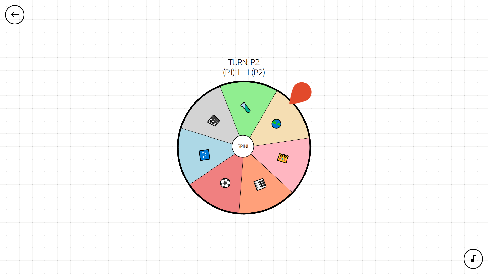

# Trivia App 🎡

Trivia App es un juego que consiste en una batalla de trivia entre 2 jugadores. El mismo fue desarrollado con [**React JS**](https://reactjs.org/).   

## Tecnologías 🛠️

- [**React JS**](https://reactjs.org/)
- [**SASS**](https://sass-lang.com/install)

## Librerías 📚

- [**React Router DOM**](https://www.npmjs.com/package/react-router-dom)
- [**MUI**](https://mui.com/)

## Autor ✍

- **Alejo Feas Matej** - *FullStack Web Developer en formación* - [alefeas](https://github.com/alefeas)

## Licencias 📃

Cualquier persona es libre de analizar, estudiar, copiar o mejorar este proyecto. Se agradecerá citar esta fuente cuando sea usado.